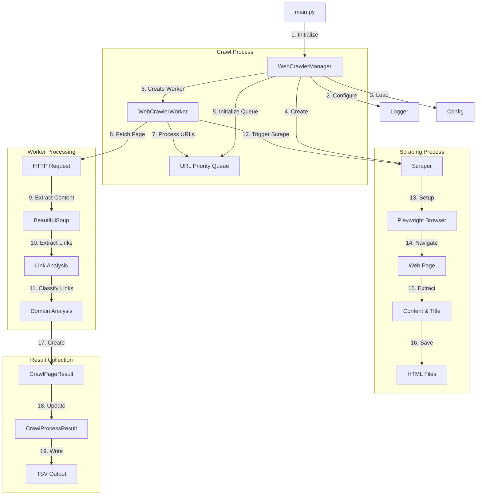

# Advanced Asynchronous Web Crawler

A high-performance, asynchronous web crawler with integrated scraping capabilities. This crawler combines efficient URL processing with powerful content extraction, making it suitable for both large-scale web crawling and focused content scraping tasks.

## Key Features

- **Asynchronous Processing**: Multi-threaded crawling with configurable worker count
- **Smart Content Extraction**: 
  - Playwright-based dynamic content scraping
  - BeautifulSoup4 for static HTML parsing
  - Handles JavaScript-rendered content
- **Efficient Resource Management**:
  - Shared browser instance across workers
  - Thread-safe URL queue and visited tracking
  - Automatic CPU core optimization
- **Robust Error Handling**:
  - Automatic retry mechanisms
  - Comprehensive error logging
  - Process recovery capabilities
- **Organized Output**:
  - Domain-specific job directories
  - Structured content storage
  - Detailed crawl statistics

## Architecture

The crawler is built on three core components working in harmony:

1. **WebCrawlerManager**
   - Coordinates the entire crawling process
   - Manages shared resources and state
   - Handles worker creation and scheduling
   - Processes final results

2. **WebCrawlerWorker**
   - Processes individual URLs
   - Extracts and analyzes links
   - Manages depth tracking
   - Handles page-level errors

3. **Scraper**
   - Controls browser automation
   - Extracts page content
   - Handles dynamic content
   - Manages content storage

## Component Workflow

The following diagram illustrates the component interaction flow:



## Installation

### Prerequisites

- Python 3.11+
- [Poetry](https://python-poetry.org/) for dependency management

### Steps

1. Clone the repository:
```bash
git clone https://github.com/yourusername/webcrawler.git
cd webcrawler
```

2. Install Poetry (if not already installed):
```bash
# macOS/Linux
curl -sSL https://install.python-poetry.org | python3 -

# Windows PowerShell
(Invoke-WebRequest -Uri https://install.python-poetry.org -UseBasicParsing).Content | py -
```

3. Configure Poetry to create virtual environment in project directory (optional):
```bash
poetry config virtualenvs.in-project true
```

4. Install dependencies:
```bash
# Install all dependencies
poetry install

# Install Playwright browsers
poetry run playwright install
```

5. Create and configure `.env`:
```env
JOBS_DIR=".jobs"
SCRAPE_DIR="scrape"
WEB_PAGE_USER_AGENT="Mozilla/5.0..."
HTTP_REQUEST_TIMEOUT=10
LOG_LEVEL=DEBUG
MAX_BATCH_SIZE=100
BROWSER_HEADLESS=true
```

## Dependencies

Managed through Poetry (`pyproject.toml`):

- **Core**:
  - Python 3.11+
  - aiohttp: Async HTTP client
  - Playwright: Browser automation
  - BeautifulSoup4: HTML parsing

- **Utilities**:
  - environs: Environment management
  - pathvalidate: Path sanitization
  - pydantic: Data validation
  - tabulate: Output formatting

View all dependencies:
```bash
poetry show
```

## Usage

### Basic Usage
```bash
poetry run python -m src.app.web_crawler <root_url> [options]
```

### Options
- `--depth`: Maximum crawl depth (default: 3)
- `--workers`: Number of concurrent workers (-1 for CPU count, default: -1)
- `--batch-size`: URLs per batch (default: 100)
- `--timeout`: Request timeout in seconds (default: 10)
- `--headless`: Run browser in headless mode (default: true)

### Examples
```bash
# Basic crawl with default settings
poetry run python -m src.app.web_crawler https://example.com

# Deep crawl with custom settings
poetry run python -m src.app.web_crawler https://example.com --depth 5 --workers 4 --batch-size 50

# Interactive mode with visible browser
poetry run python -m src.app.web_crawler https://example.com --headless false
```

## Output Structure

```
.jobs/
└── domain.com/                 # Domain-specific directory
    ├── scrape/                # Scraped content
    │   └── url_hash/          # URL-specific directory
    │       └── content.html   # Scraped HTML content
    └── results/               # Crawl results
        └── crawl_TIMESTAMP.tsv  # Detailed crawl data
```

### TSV Output Fields
- `url`: Crawled URL
- `depth`: Crawl depth from root
- `success`: Crawl success status
- `error`: Error message (if any)
- `links_count`: Total links found
- `same_domain_links`: Internal links count
- `external_links`: External links count
- `domain_ratio`: Internal/total links ratio
- `timestamp`: Processing timestamp
- `scrape_path`: Path to scraped content

## Development

### Project Structure
```
src/
├── app/
│   ├── web_crawler/          # Core crawling logic
│   ├── scraper/             # Content extraction
│   └── models/              # Data models
└── utils/                   # Utility modules
```

### Best Practices
- Type hints throughout
- Comprehensive logging
- Error handling at all levels
- Resource cleanup
- Configurable components

## Future Improvements

1. **Performance**
   - Distributed crawling support
   - Advanced rate limiting
   - Memory optimization

2. **Features**
   - Custom scraping rules
   - Proxy support
   - Content analysis
   - Search capabilities

3. **Infrastructure**
   - Unit test suite
   - CI/CD pipeline
   - Docker support

## License

MIT License - See LICENSE file for details
