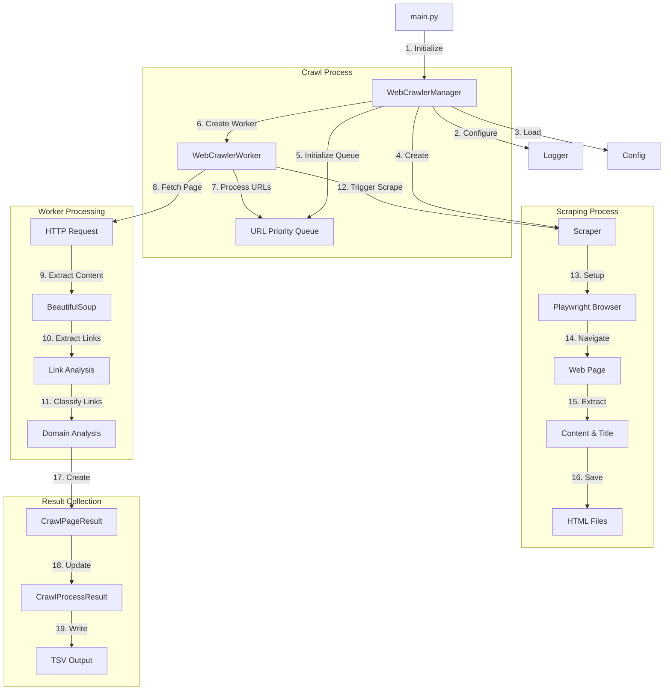

```mermaid
graph TD
    A[main.py] -->|1. Initialize| B[WebCrawlerManager]
    B -->|2. Configure| C[Logger]
    B -->|3. Load| D[Config]
    B -->|4. Create| S[Scraper]
    
    subgraph "Crawl Process"
        B -->|5. Initialize Queue| Q[URL Priority Queue]
        B -->|6. Create Worker| E[WebCrawlerWorker]
        E -->|7. Process URLs| Q
    end
    
    subgraph "Worker Processing"
        E -->|8. Fetch Page| I[HTTP Request]
        I -->|9. Extract Content| J[BeautifulSoup]
        J -->|10. Extract Links| K[Link Analysis]
        K -->|11. Classify Links| L[Domain Analysis]
    end
    
    subgraph "Scraping Process"
        E -->|12. Trigger Scrape| S
        S -->|13. Setup| P[Playwright Browser]
        P -->|14. Navigate| W[Web Page]
        W -->|15. Extract| C1[Content & Title]
        C1 -->|16. Save| F1[HTML Files]
    end
    
    subgraph "Result Collection"
        L -->|17. Create| R1[CrawlPageResult]
        R1 -->|18. Update| R2[CrawlProcessResult]
        R2 -->|19. Write| T[TSV Output]
    end
```
