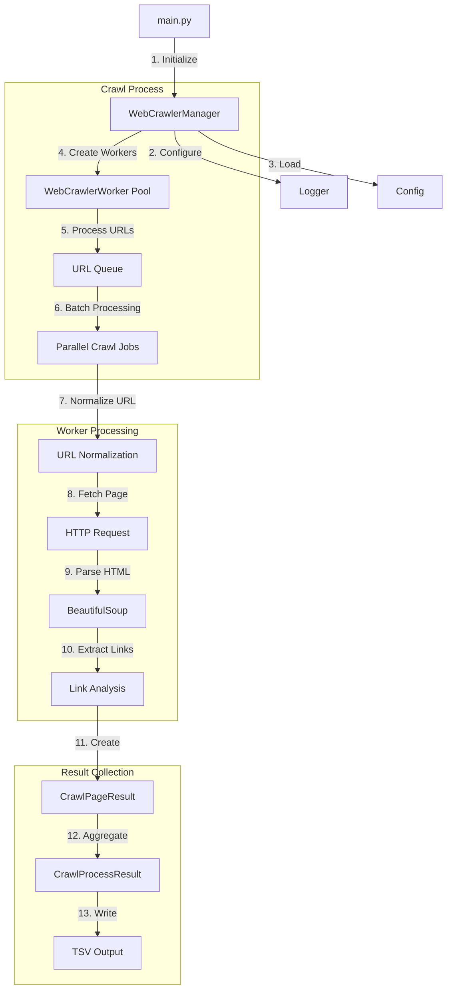

# Web Crawler Architecture

This document describes the architecture and flow of the web crawler application.

## Component Flow Diagram

## Component Description

### Main Components

1. **WebCrawlerManager**
   - Coordinates the crawling process
   - Manages worker pool
   - Handles result aggregation

2. **WebCrawlerWorker**
   - Performs actual page crawling
   - Normalizes URLs
   - Extracts and analyzes links

3. **Data Models**
   - CrawlPageResult: Individual page crawl data
   - CrawlProcessResult: Overall crawl session data

### Process Flow

1. **Initialization**
   - Start from main.py with URL and depth
   - Configure logging and settings
   - Create WebCrawlerManager

2. **Crawl Process**
   - Create worker pool
   - Process URLs in parallel
   - Manage URL queue and batches

3. **Page Processing**
   - Normalize and validate URLs
   - Fetch page content
   - Parse HTML and extract links
   - Analyze link relationships

4. **Result Handling**
   - Create page-level results
   - Aggregate into process results
   - Write to TSV output file
