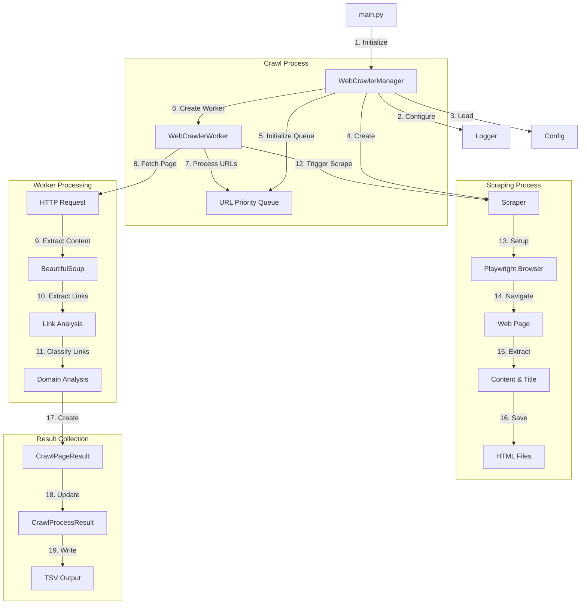

# Web Crawler Architecture

This document describes the architecture and flow of the web crawler application.

## Component Flow Diagram



## Component Description

### Main Components

1. **WebCrawlerManager**
   - Coordinates the crawling process
   - Creates and manages Scraper instance
   - Manages worker pool
   - Handles result aggregation

2. **WebCrawlerWorker**
   - Performs actual page crawling
   - Normalizes URLs
   - Extracts and analyzes links
   - Uses shared Scraper instance for content extraction

3. **Scraper**
   - Handles web page content extraction
   - Manages browser automation with Playwright
   - Saves content to organized directory structure
   - Maintains context of root URL for file organization

4. **Data Models**
   - CrawlPageResult: Individual page crawl data
   - CrawlProcessResult: Overall crawl session data

### Directory Structure

```
project_root/
└── .jobs/
    └── domain/              # Based on root URL domain
        ├── crawler_results.tsv
        └── scrape/
            └── url_domain/  # Based on target URL
                └── url.html
```

### Process Flow

1. **Initialization**
   - WebCrawlerManager is created with root URL
   - Scraper instance is created with root URL context
   - Worker pool is initialized with shared Scraper

2. **URL Processing**
   - URLs are processed in batches
   - Each worker uses the shared Scraper instance
   - Content is extracted and saved in domain-specific directories

3. **Content Organization**
   - Scraped content is saved under `.jobs/<root_domain>/scrape/<url_domain>/`
   - Crawler results are saved as TSV files under `.jobs/<root_domain>/`
   - File paths maintain context of both root URL and target URL

4. **Result Collection**
   - Page results include links and scrape file paths
   - Process results aggregate all crawled pages
   - Results are saved in TSV format for analysis

### Configuration

Key configuration options in `.env`:
- JOBS_DIR: Base directory for all crawl outputs
- SCRAPE_DIR: Subdirectory for scraped content
- Other settings for timeouts, user agents, etc.

### Error Handling

- Failed scrapes are logged but don't stop the crawl
- Directory creation is handled safely with proper permissions
- URL and filename sanitization for safe file operations
- Proper cleanup of browser resources
